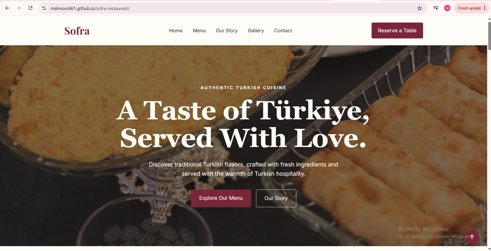

> **Portfolio Project:** Sofra is a fictional Turkish restaurant website created to demonstrate frontend web development skills.
# Sofra — Turkish Restaurant Website

A modern and responsive Turkish restaurant website inspired by Turkish culture, hospitality, and fine dining.
## Website Preview

## Features

- Elegant Turkish-inspired design
- Responsive layout for desktop and mobile
- Hero section with call-to-action buttons
- Signature dishes section
- Restaurant story section
- Image gallery
- Customer reviews
- Reservation form
- Date validation
- Back-to-top button
- Smooth scrolling and hover effects

## Technologies Used

- HTML5
- CSS3
- JavaScript
- Git
- GitHub

## Project Purpose

This project was created as part of my web development portfolio to demonstrate frontend development, responsive design, and basic JavaScript functionality.

## Author

Mahnoor Ahsan
